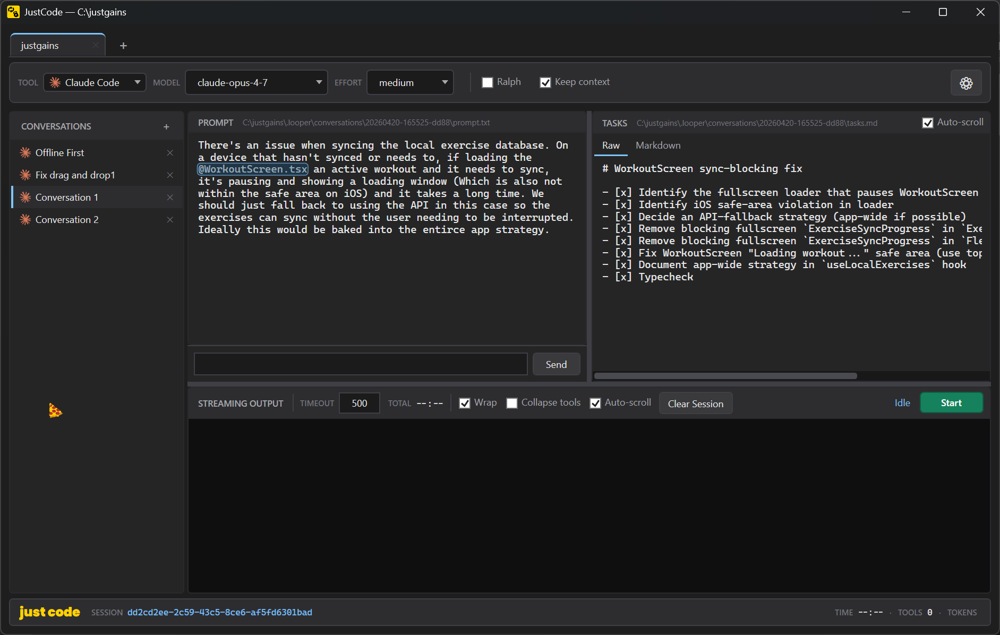

<div align="center">


### A Windows desktop companion for **Claude Code** and **OpenAI Codex** CLIs

Write a prompt, hit Start, watch it work. Loop it, interject mid-run, and keep context across restarts.


</div>

<br clear="right"/>

<p align="center">
  
</p>

---

## What it does

- **One-shot or looped runs.** Fire the prompt once, or enable **Ralph** to re-run up to N iterations — "keep going until the task list is done" style.
- **Session continuity.** With *Keep Context*, subsequent iterations (and re-launches of the app) resume the previous CLI session (`claude --resume <id>` / `codex exec resume <id>`). Session ids are persisted per-conversation and auto-expire after 24 h.
- **Chat while it runs.** Drop follow-ups into the chat box at the bottom of the prompt pane. They queue up and fire as their own CLI turns between iterations. Send while idle and the loop auto-starts for that one turn.
- **@-mentions everywhere.** Type `@` in either the prompt or the chat box for a fuzzy file picker. Short labels in the visible text get expanded to full relative paths at submission.
- **Tasks file with summaries.** The model maintains `.looper/conversations/<id>/tasks.md` using GitHub checkbox syntax and appends a dated session summary at the end of each run. Live preview as Markdown or raw.
- **Loop-health pills in the status bar.** Live indicators for open task count, progress stalled, circuit open, and `EXIT_SIGNAL` received.
- **Ralph-inspired loop control.** Git-backed progress detection, circuit breaker after 3 stuck iterations, explicit `---RALPH_STATUS---` exit gate, question/error corrective guidance injected into the next iteration.
- **Benchmarks.** Session id, total elapsed, tool-call count, and token usage (in / out / cached with live estimate while streaming).

---

## Install

**Requires**: Windows 10/11 · .NET 10 SDK · `claude` and/or `codex` on PATH.

```bash
dotnet build JustCode.csproj
dotnet run --project JustCode.csproj
```

Or open `JustCode.csproj` in Visual Studio / Rider and F5.

---

## Quick start

1. **Add a project** — click `+` on the project tab bar and pick the directory you want Claude / Codex to operate in.
2. **Pick a tool** — toolbar selector for *Claude Code* or *Codex*; optional model + effort overrides.
3. **Write a prompt** — use `@filename` to reference files; a popup shows matches live.
4. **Hit Start** — streaming output fills the console. Tasks written to `tasks.md` show up in the TASKS pane.
5. *(Optional)* **Enable Ralph** — toggle to loop the prompt; set max iterations with the stepper. Each iteration re-sends, with loop context (open task count, last summary, corrective guidance) prepended.
6. *(Optional)* **Keep Context** — subsequent iterations resume the same CLI session so the model keeps memory of what it already did.

---

## Chat box

At the bottom of the PROMPT pane. Every message you send becomes its own CLI turn, either mid-loop (slotted between iterations) or as a standalone turn if nothing's running.

- **Enter** sends. **Shift+Enter** inserts a newline.
- **Up / Down** recalls previously-queued messages and lets you edit them in place. **Esc** exits recall.
- **@-mentions** work here too.
- Click **✕** on a queued chip to remove it before it fires.
- Queued messages don't count against Ralph's iteration budget — they slip in between scheduled iterations.

---

## Loop control & health

Every iteration, the wrapper prepends loop context to the prompt:

```
LOOP 3/5 · 7 open tasks · 2 done · CIRCUIT HALF-OPEN

--- CORRECTIVE GUIDANCE (from prior iteration) ---
- Progress has stalled for two iterations. Land concrete edits this run.

--- LAST SESSION SUMMARY (from tasks.md) ---
- Fixed the auth middleware bug; added tests in auth_test.cs.
- Blocker: legal hasn't signed off on token format yet.

--- USER PROMPT ---
<your prompt>
```

The model is asked to end each response with a status block:

```
---RALPH_STATUS---
EXIT_SIGNAL: true
STATUS: COMPLETE
---RALPH_STATUS---
```

When `EXIT_SIGNAL: true` appears, JustCode exits the loop early and lights the green **✓ COMPLETE** pill in the status bar.

### Status-bar pills

| Pill | When | Meaning |
|---|---|---|
| **TASKS** *N* open · *N* done | Whenever `tasks.md` has checkboxes | Running count from the tasks file |
| **⚠ PROGRESS STALLED** | 2 consecutive iterations with no git changes | Next iteration gets a "land concrete edits" nudge |
| **⛔ CIRCUIT OPEN** | 3 consecutive iterations with no git changes | Loop pauses automatically; fix manually and press Start |
| **✓ COMPLETE** | Model emitted `EXIT_SIGNAL: true` | Loop ended early at the model's request |

---

## Keyboard shortcuts

| Where | Key | What |
|---|---|---|
| Prompt box | **Ctrl+Enter** | Start / Stop the loop |
| Prompt box | `@` then typing | Open file mention popup |
| Mention popup | **↑ / ↓** | Select |
| Mention popup | **Tab / Enter** | Accept selection |
| Mention popup | **Esc** | Dismiss |
| Chat box | **Enter** | Send (queues the message) |
| Chat box | **Shift+Enter** | Newline |
| Chat box | **↑ / ↓** | Recall / navigate queued messages |
| Chat box | **Esc** | Exit recall mode |

---

## File layout

Per project, under your working directory:

```
.looper/
  project.json                          ← project-level config
  conversations/<id>/settings.json      ← per-conversation engine settings, last session id
  conversations/<id>/prompt.txt         ← persisted prompt (auto-saved while typing)
  conversations/<id>/tasks.md           ← task list + session summaries
  conversations/<id>/console.log        ← rolling last-500-lines of console output
```

Global config: `%AppData%\com.justgains.looper\looper.conf` — defaults for new conversations plus output-styling rules.

The `.looper/` folder should be gitignored (JustCode's own `.gitignore` already excludes it). Deleting a `conversations/<id>/` directory cleanly resets that conversation.

> The folder name `.looper/` and config filename `looper.conf` are preserved from the project's previous name so existing installs don't lose data.

---

## Keep Context & sessions

With **Keep Context** on:

- Iteration 1 resumes the last captured session id if one's persisted. Otherwise starts fresh and captures the new id.
- Iteration 2+ always resumes. Queued chat messages also resume.
- **Clear Session** button wipes console + session id *and* the rolling log — next Start begins clean.
- Sessions auto-expire after **24 hours** to prevent resuming into context the model has forgotten.

You can close JustCode and reopen it — your conversation picks up where it left off.

---

## Timeouts & inactivity

Each iteration has an inactivity timeout (default 120 s, configurable). If the CLI produces no output for that long, JustCode kills the process and retries the current iteration. The timeout is relaxed **3×** while the model is inside a thinking block, since reasoning passes can legitimately go quiet for long stretches.

---

## Troubleshooting

- **"executable not found on PATH"** — verify `claude` or `codex` runs in a normal terminal.
- **Session id stays blank** — the CLI didn't emit one on the first turn. Keep Context won't find anything to resume; the next run will capture fresh.
- **Codex sessions not resuming** — JustCode watches `~/.codex/sessions/` for newly-created session files. If your Codex install writes sessions elsewhere, resume won't find them.
- **Circuit keeps opening** — usually means the model is "planning" without editing. Edit the prompt to be more directive, or clear the session to reset.

---

<div align="center">
<sub>© JustGains · Licensed under the MIT License</sub>
</div>
